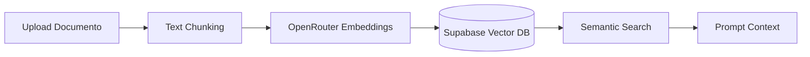

# 📄 Sezione Documenti e Architettura RAG

La **Sezione Documenti** gestisce il patrimonio informativo del portale. Consente di indicizzare leggi, decreti e contratti della scuola e permette al motore di ricerca semantica (RAG) di attingere a fonti ufficiali in tempo reale.

---

## 🏛️ Elenco dei Documenti Indicizzati

Il sistema ospita e indicizza atti ufficiali tra cui:
*   Contratti Collettivi Nazionali di Lavoro (CCNL Comparto Scuola).
*   Ordinanze Ministeriali (OM per l'aggiornamento delle graduatorie).
*   Circolari Amministrative (note esplicative MIM ed ex MIUR).
*   Decreti Legge in ambito scolastico.

---

## ⚙️ La Pipeline del RAG (Flusso Tecnico)

Il sistema RAG (Retrieval-Augmented Generation) opera chirurgicamente sui file attraverso i moduli in `src/rag/`:

### 1. Ingestione dei File (`ingestion.ts` e `storage.ts`)
*   I documenti vengono caricati nel database Supabase.
*   Ogni documento viene catalogato con metadati specifici (titolo, fonte ufficiale, data di pubblicazione, link al PDF originale del ministero).

### 2. Frammentazione del Testo (`chunking.ts`)
*   Il testo viene diviso in frammenti (*chunks*) logici per non perdere il contesto normativo.
*   **Regola di Chunking**: Frammenti di circa **1000 caratteri** con un'area di sovrapposizione (*overlap*) di **200 caratteri** per garantire che nessuna frase o articolo di legge venga interrotto a metà.

### 3. Generazione dei Vettori (`openrouter.ts`)
*   Ogni frammento viene inviato alle API di OpenRouter (modello `text-embedding-ada-002` o equivalente standard a 1536 dimensioni) per generare il rispettivo vettore numerico.

### 4. Salvataggio su Database (`supabaseClient.ts`)
*   I frammenti vengono salvati nella tabella `document_chunks`.
*   I vettori numerici vengono salvati nella tabella `embeddings` collegata tramite chiave esterna.

### 5. Recupero Semantico (`retrieval.ts`)
*   Quando un utente fa una domanda, essa viene vettorizzata e confrontata con i vettori a database usando la similitudine del coseno tramite la funzione Postgres SQL `match_embeddings`.
*   I 3 o 4 frammenti con la similarità maggiore vengono selezionati ed inseriti come contesto nel prompt dell'assistente AI.

---

## 🎨 Integrazione con Skill del Copilota

*   **`impeccable`**: Validazione formale della frammentazione del testo. Evita la perdita di capoversi e garantisce che i riferimenti agli articoli di legge rimangano sempre associati al testo del bando corrispondente.
*   **`taste-skill`**: Interfaccia di caricamento documenti pulita per l'amministratore, con indicatori di caricamento e barra di avanzamento circolare. Elenco dei documenti consultabili dall'utente con filtri per "Data di Pubblicazione" e "Tipologia di Atto".

---

## 🔗 Riferimenti Istituzionali
*   Torna alla **[[00 - Benvenuto|Pagina Iniziale]]**.
*   Consulta lo **[[Schema Database]]** per le query SQL dei vettori.
