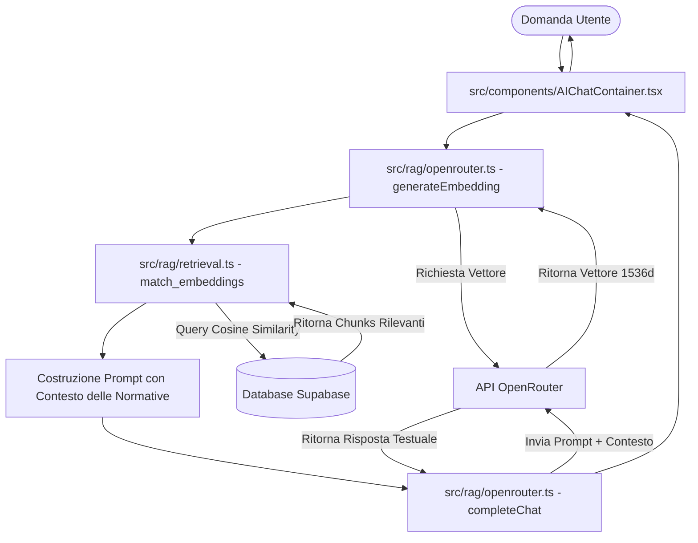

# 🏗️ Architettura e Stato dell'Applicazione

Questo documento descrive la struttura del codice, il funzionamento del routing (navigazione) e il flusso di dati (RAG) all'interno di **Sportello Scuola 2.0**.

---

## 📂 Struttura Cartelle del Progetto

Il progetto frontend è basato su React + TypeScript + Vite, organizzato come segue:

*   `src/App.tsx` — Componente principale contenente la definizione delle rotte.
*   `src/main.tsx` — Entry point dell'applicazione React.
*   `src/index.css` — Foglio di stile principale con le variabili di design (colori, font).
*   `src/components/` — Componenti UI riutilizzabili (header, footer, bottoni, schede, breadcrumb, ecc.).
*   `src/pages/` — Componenti pagina caricati in base alla rotta corrente.
*   `src/rag/` — Logica di integrazione per l'AI, database Supabase e OpenRouter.

---

## 🗺️ Mappa delle Pagine e Rotte (`App.tsx`)

L'applicazione usa `react-router-dom` per gestire la navigazione client-side:

| Percorso (Route) | Pagina React (`src/pages/`) | Componente principale (`src/components/`) | Descrizione |
| :--- | :--- | :--- | :--- |
| `/` | `HomePage.tsx` | `Hero`, `PlatformUsers`, `News`, `Deadlines` | Homepage del portale |
| `/assistente/*` | `AssistantPage.tsx` | `AIChatContainer`, `AssistantsAI` | Pagina dei chatbot AI (RAG) |
| `/calcolo-punteggio`| `ScorePage.tsx` | `PunteggioGPS` | Calcolatore interattivo del punteggio |
| `/normative` | `NormativePage.tsx` | `NormativeDocuments` | Raccolta e ricerca delle normative |
| `/notizie` | `NewsPage.tsx` | `News` | Archivio notizie MIM |
| `/scadenze` | `DeadlinesPage.tsx` | `Deadlines` | Scadenziario scolastico |
| `/faq` | `FAQPage.tsx` | `FAQ` | Domande frequenti |
| `/contatti` | `ContactPage.tsx` | `Contact` | Modulo di contatto e supporto |
| `/interpelli` | *(In arrivo)* `InterpelliPage.tsx` | `InterpelliList`, `InterpelliFilters` | Centro Interpelli Nazionale |

---

## 🧠 Flusso Dati dell'Assistente AI (RAG)

Il sistema RAG (Retrieval-Augmented Generation) risponde alle domande degli utenti basandosi sulle normative scolastiche caricate a database:

1.  **Generazione dell'Embedding**: La domanda dell'utente viene convertita in un vettore numerico (tramite l'API Embeddings di OpenRouter).
2.  **Ricerca Semantica (Supabase)**: Il database confronta questo vettore con quelli dei documenti salvati (`embeddings` e `document_chunks`) usando la similitudine del coseno per trovare i frammenti più coerenti con la domanda.
3.  **Generazione della Risposta**: L'agente unisce la domanda dell'utente ai frammenti di testo trovati nel database e invia il tutto a un LLM (via OpenRouter) affinché risponda usando solo fonti verificate.

---

## 🔗 Link Correlati
*   Vedi lo **[[Schema Database]]** per le tabelle coinvolte.
*   Consulta le **[[Linee Guida Agenti]]** per integrare le modifiche visive.
*   Torna alla **[[00 - Benvenuto|Pagina Iniziale]]**.
